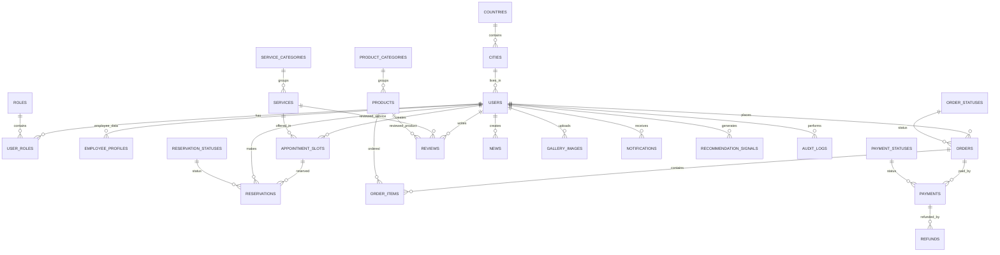

# ER dijagram

```mermaid
erDiagram
    USERS ||--o{ USER_ROLES : has
    ROLES ||--o{ USER_ROLES : contains
    COUNTRIES ||--o{ CITIES : contains
    CITIES ||--o{ USERS : lives_in
    USERS ||--o{ EMPLOYEE_PROFILES : employee_data
    SERVICE_CATEGORIES ||--o{ SERVICES : groups
    PRODUCT_CATEGORIES ||--o{ PRODUCTS : groups
    USERS ||--o{ APPOINTMENT_SLOTS : creates
    SERVICES ||--o{ APPOINTMENT_SLOTS : offered_in
    APPOINTMENT_SLOTS ||--o{ RESERVATIONS : reserved
    USERS ||--o{ RESERVATIONS : makes
    RESERVATION_STATUSES ||--o{ RESERVATIONS : status
    USERS ||--o{ ORDERS : places
    ORDER_STATUSES ||--o{ ORDERS : status
    ORDERS ||--o{ ORDER_ITEMS : contains
    PRODUCTS ||--o{ ORDER_ITEMS : ordered
    ORDERS ||--o{ PAYMENTS : paid_by
    PAYMENT_STATUSES ||--o{ PAYMENTS : status
    PAYMENTS ||--o{ REFUNDS : refunded_by
    USERS ||--o{ REVIEWS : writes
    SERVICES ||--o{ REVIEWS : reviewed_service
    PRODUCTS ||--o{ REVIEWS : reviewed_product
    USERS ||--o{ NEWS : creates
    USERS ||--o{ GALLERY_IMAGES : uploads
    USERS ||--o{ NOTIFICATIONS : receives
    USERS ||--o{ RECOMMENDATION_SIGNALS : generates
    USERS ||--o{ AUDIT_LOGS : performs
```

Ovaj ER dijagram predstavlja pocetni plan baze podataka za aplikaciju eBeautySalon. Tokom implementacije se moze dopuniti, ali mora ostati uskladjen sa pravilima predmeta.
